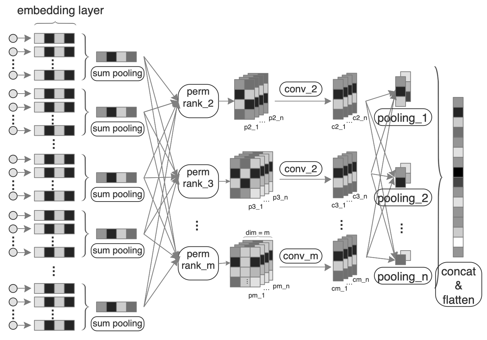
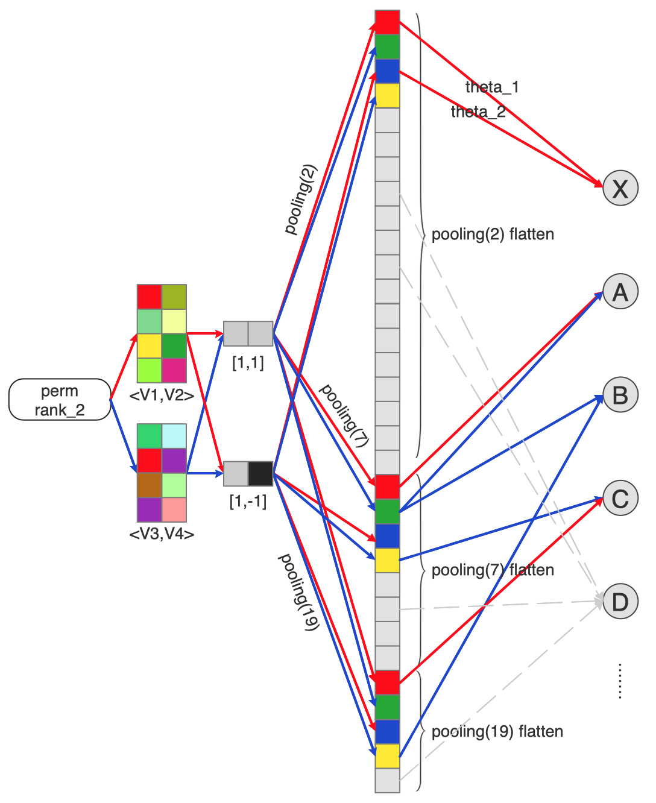

Structured Semantic Model supported Deep Neural Network for Click-Through Rate Prediction




# File Description

* ```./wide_deep.py``` : Traditional official Wide\&Deep 

* ```./wide_deep_emb_conv.py``` : Wide\&Deep with convolution and pooling (SSM main code)

* ```./sparse_array_categorical_column.py``` : Sparse array feature with CSV format input

* ```./submit_local.sh``` : Run local

# How to run
1. Run ```sh submit_local.sh```

# Sample Submit Command

```
type=wide_deep_conv   # wide, deep, wide_deep, wide_deep_conv are available
python/bin/python3 wide_deep_emb_conv.py \
    --checkpoints_dir=$model_dir \
    --save_checkpoints_steps=1000 \
    --batch_size=10000 \
    --num_epochs=10000000 \
    --data_dir=$sample_data \
    --validate_dir=$eval_data \
    --shuffle_buffer_size=10000 \
    --embedding_model=./model_zoo/wide_deep_emb_conv_cluster/model.ckpt-114471 \
    --pretrain=no \
    --model_type=${type}
```

# Submit Command Tutorial

* ### --pretrain

    * Indicates pretrain model or not.

* ### --embedding_model

    * The tf model file pre-trained. 
    
